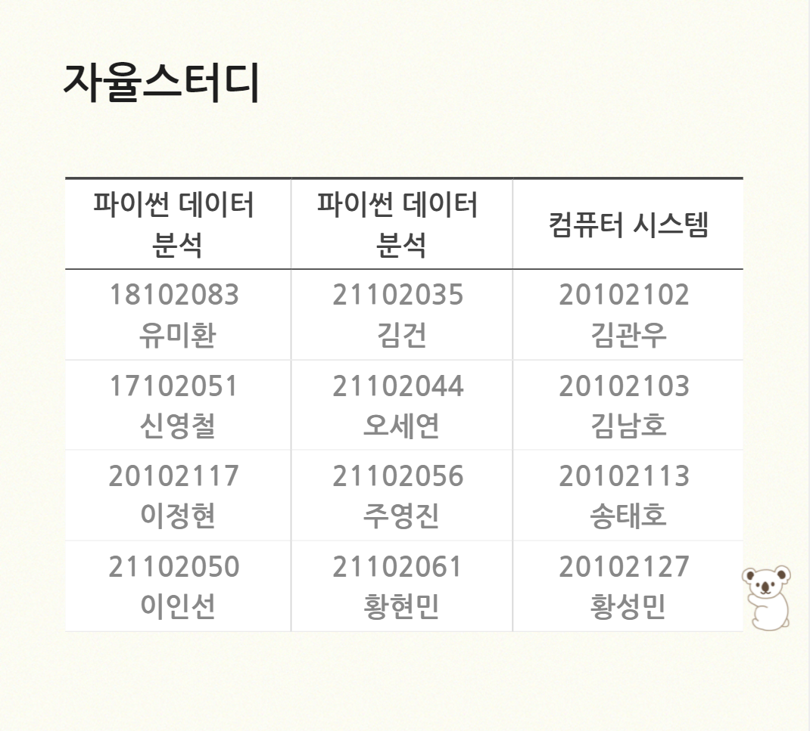
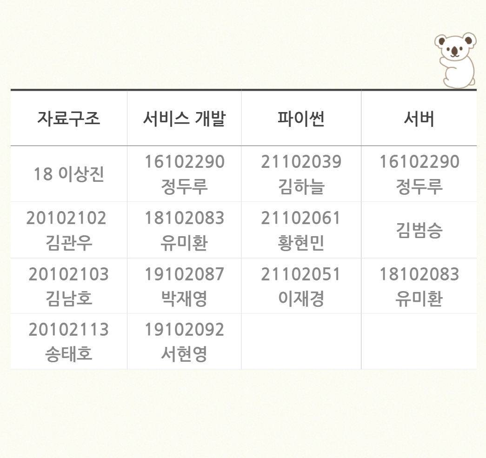

 ---
layout: single
title: "코알라 스터디 인원 배정 공지"
---
 
 🐨 코알라 스터디 인원배정 공지 🐨 
안녕하세요, 서울과학기술대학교 ITM전공 동아리 코알라입니다🙂 
많은 분들이 이번 코알라 스터디를 신청해 주셨는데요😉  
여러분의 스터디 신청을 바탕으로 코알라 스터디 인원 배정을 완료했습니다!!  
 
 
 
📍 10/1(금)까지 스터디 별로 팀원의 역할을 정해주세요 
📍 10/3(일)까지 스터디 별로 활동계획서를 제출해주세요 
📍 다음주부터 스터디 별로 깃허브에 게시할 세부내용을 제출해주세요 
(매주 금요일까지 제출) 
⚠ 스터디 세부내용 제출은 팀장전용 슬랙 채널을 개설할 예정입니다. 
